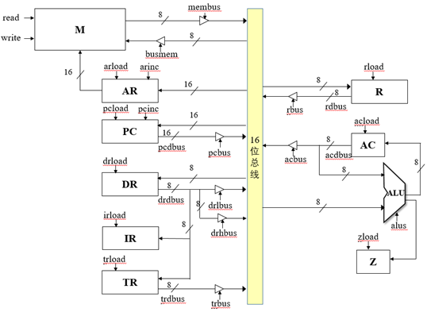

# CPU
Course Design of Principles of Computer Organization  
  
2021年计算机组成原理课设：  
  设计实现一个字长8位的CPU，所设计的系统能调试通过，
  进行仿真测试后在FPGA开发板上运行一段程序，通过检
  查程序结果的正确性来判断所设计计算机系统的正确性。

## 开发记录
- 2021/12/6 下发任务、摸鱼
- 2021/12/7 复习计组课件、Verilog语法、quartus使用
- 2021/12/8 理清任务要求，确定初步cpu数据通路，创建工程
- 2021/12/9 完成了寄存器、运算器、控制器的简单指令(MOVAC)、数据通路设计
- 2021/12/13 完成全部指令设计
- 2021/12/14 烧板测试，debug
- 2021/12/15 排除给出代码的错误
- 2021/12/16 更换总线架构，使用双总线设计

  
## 说明
- 示例机的数据通路

- 改进的数据通路  
引入一根从总线到Address Register的8位数据线，由ACloadR信号控制，
从而实现不经过alu直接将数据传入AC。
2021.12.16：换用双总线架构，如图所示
